# VESAKey  
自作キーボード(左右分割)をモニターアームに取り付けられるようにするVESAマウントです。  

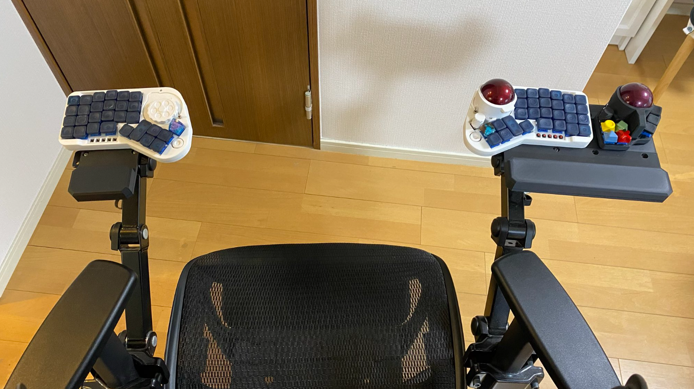

- [データ置き場](#データ置き場)
- [取り付けイメージ](#取り付けイメージ)
- [STLデータの簡単な説明](#stlデータの簡単な説明)
- [3mfデータの簡単な説明](#3mfデータの簡単な説明)
- [ライセンス/License](#ライセンスlicense)

## データ置き場  
STLデータ置き場はこちら  
3mfデータ置き場はこちら  

## 取り付けイメージ  
VESA規格(75mm x 75mm)の穴に対応します。  
M4ネジとナットが別途必要です。  
キーボードの取り付けには100円均一などで買える耐震シートを使用します。  
写真では1.8mm厚の耐震シート(ロールになって売っていた)を使用しています。  
  

キーボードを取り付けるとこんな感じ。  
耐震シートはかなり強くくっついてくれるのでちょっとやそっとでずれません。  
(※キーボードが落ちても責任はとれません。自己責任でお使いください。)  
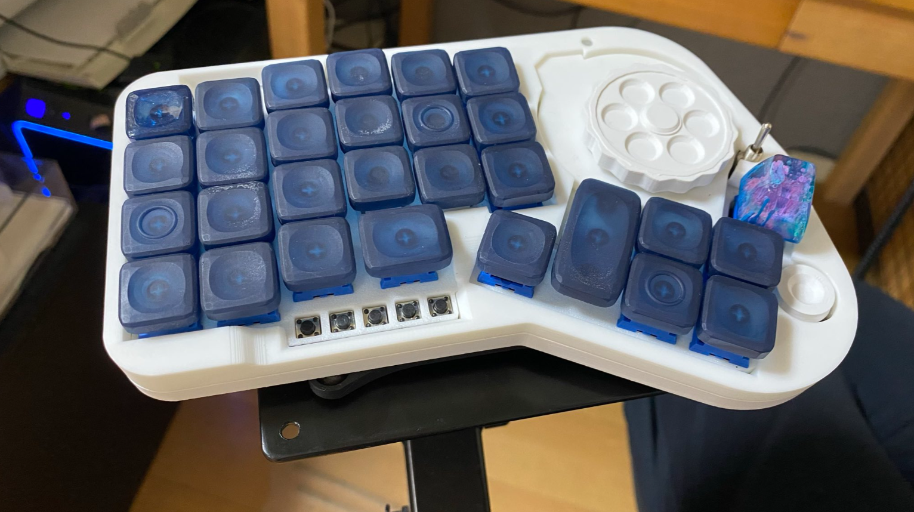

リストレストあり版も作成しました。  
手元に穴が2か所空いています。  
ここに別途印刷したリストレストを、これまた別途印刷した留め具で取り付けます。  
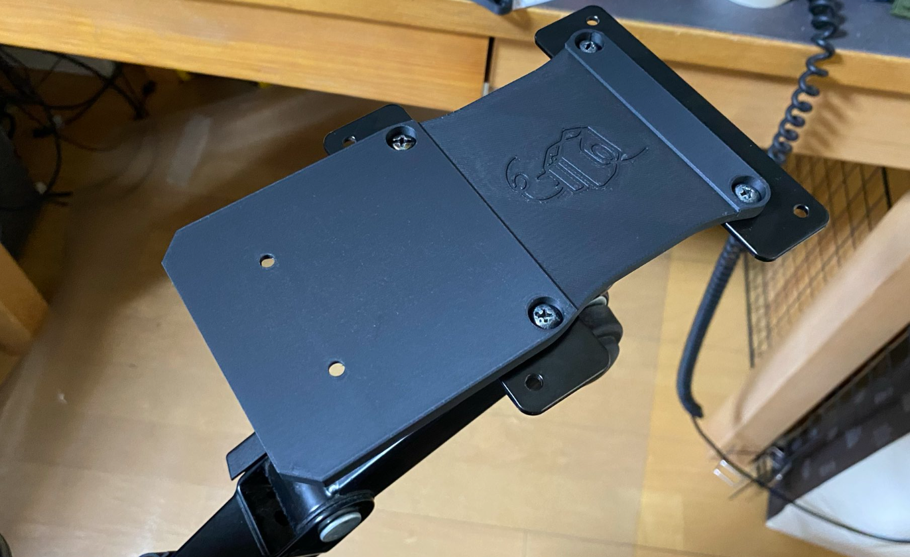  
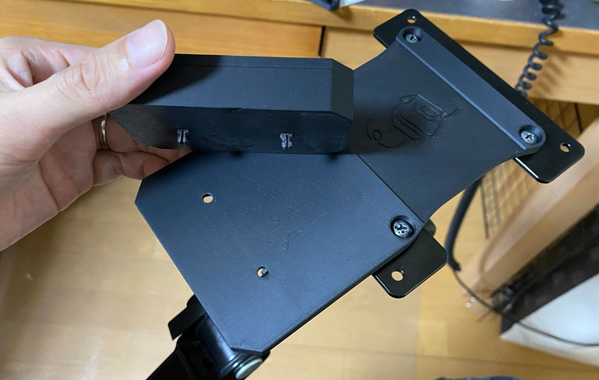  

やや大きめのキーボードなどを使用しており固定が不安な人向けに面積が広い版も作成しました。  
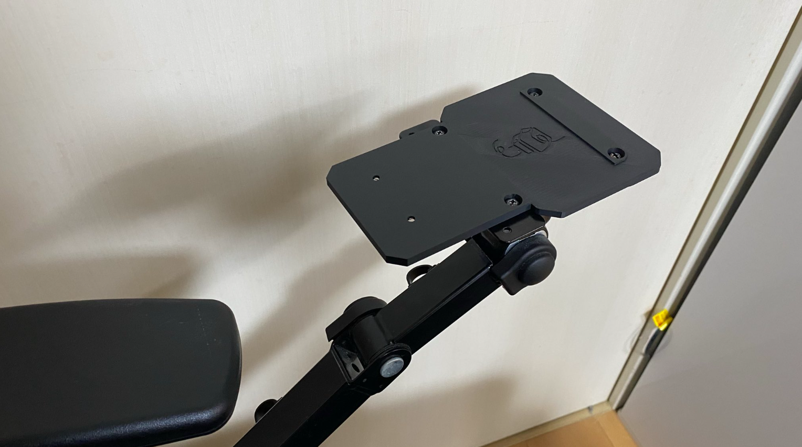

使い方は同じです。  
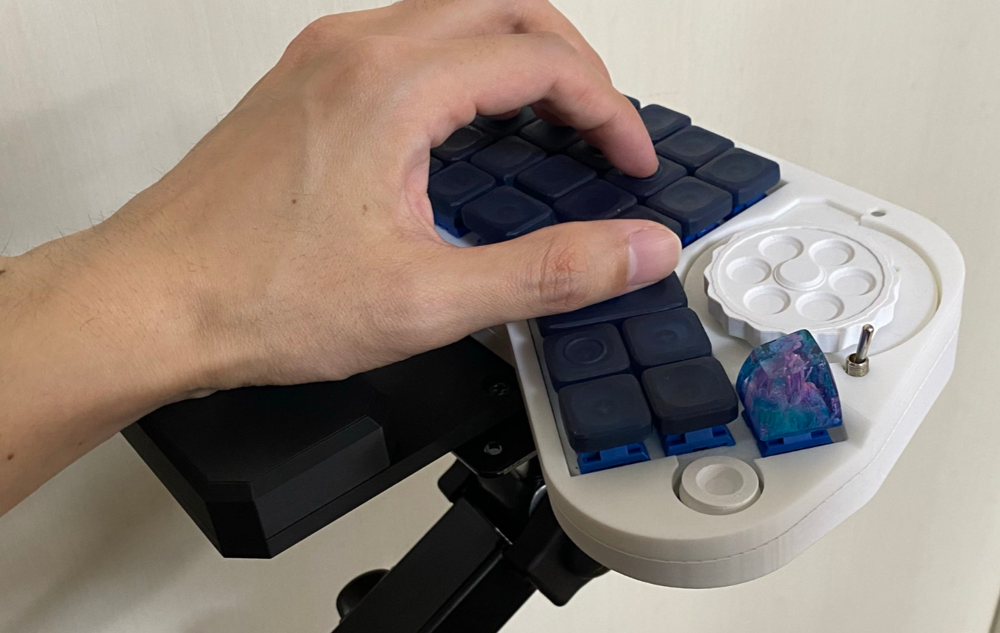

トラックボールマウスを横に置いておきたい人向けに、さらに大きい版も作成しました。  
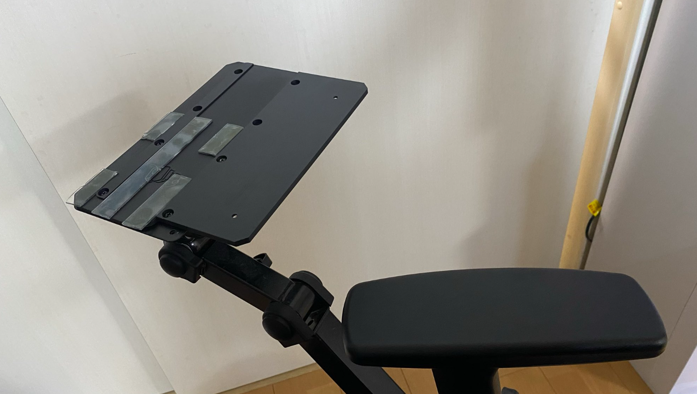  

使い方は同じです  
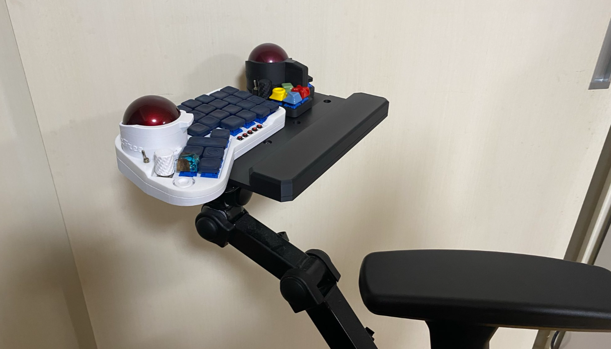  

## STLデータの簡単な説明  
サイズ違いでもろもろあります。  
1_VESAKey.stl  
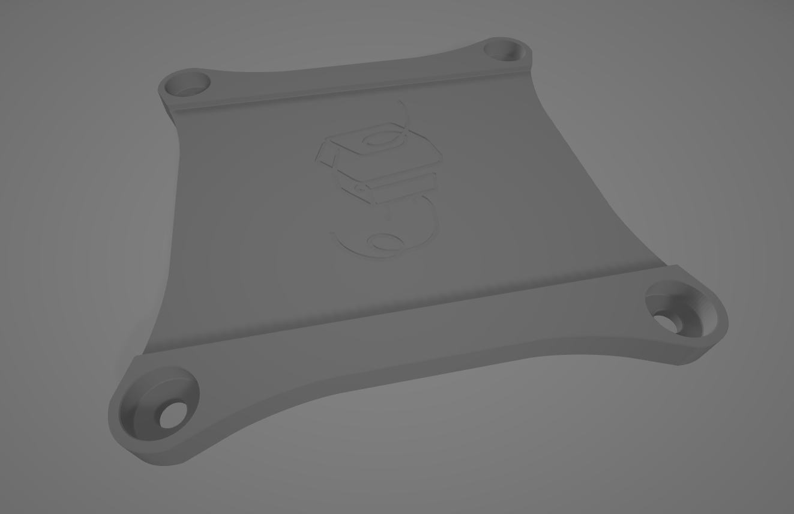  
2_VESAKeyリストレストあり.stl  
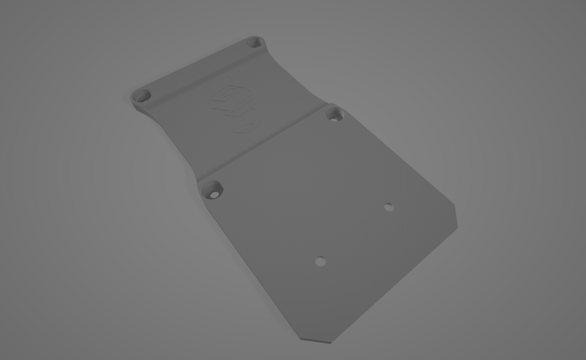  
3_VESAKeyリストレストあり大きい版.stl  
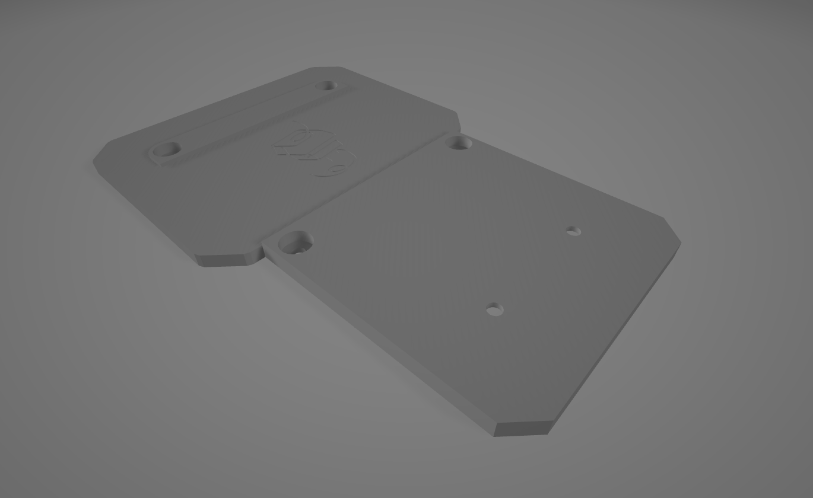
4_VESAKeyリストレスト.stl  
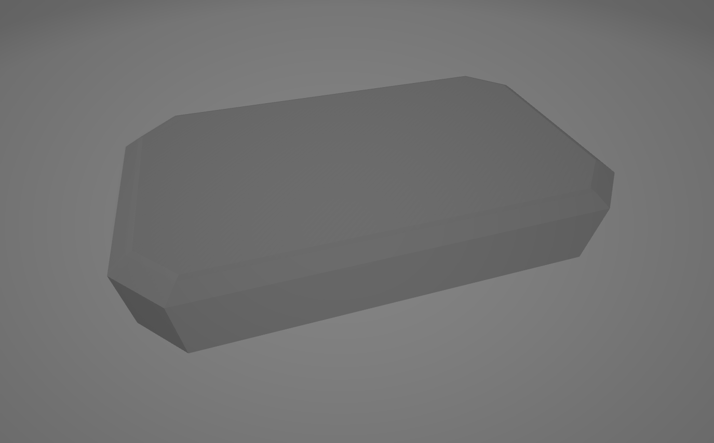  
5_VESAKeyリストレストありもっと大きい版.stl  
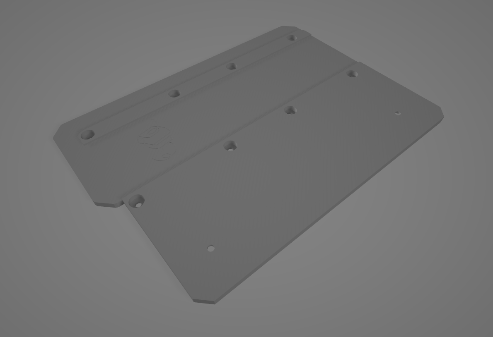
6_VESAKeyリストレストもっと大きい版.stl
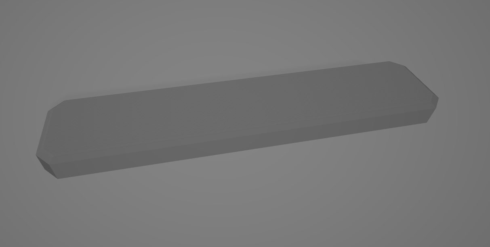
留め具.stl
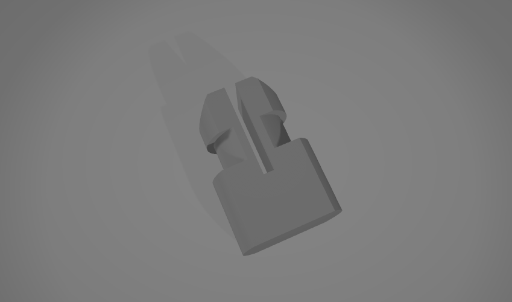

## 3mfデータの簡単な説明  
BambuStudioで開くとこんな感じです。
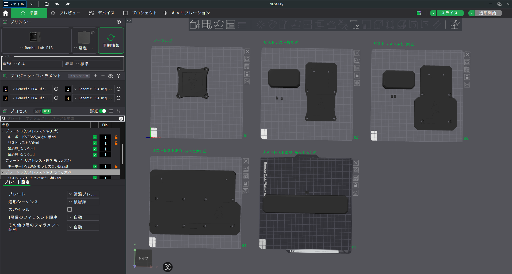

## ライセンス/License  
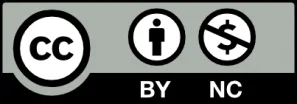

